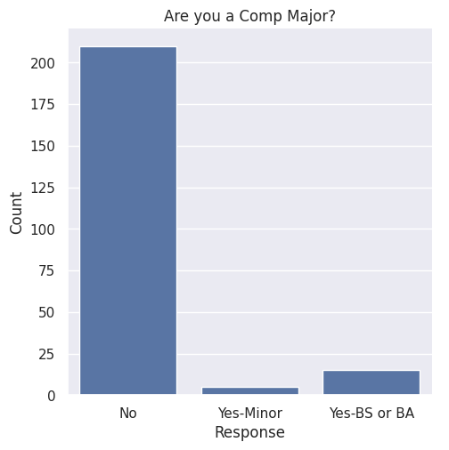
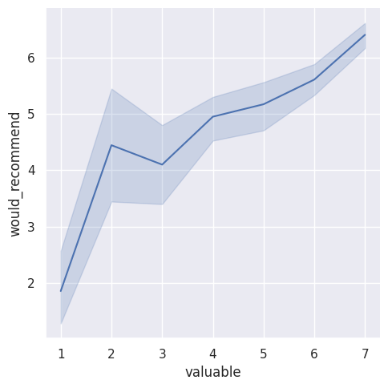
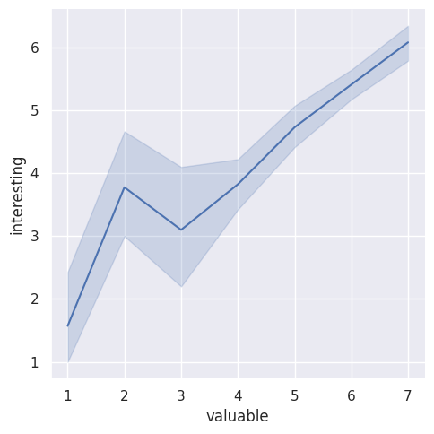
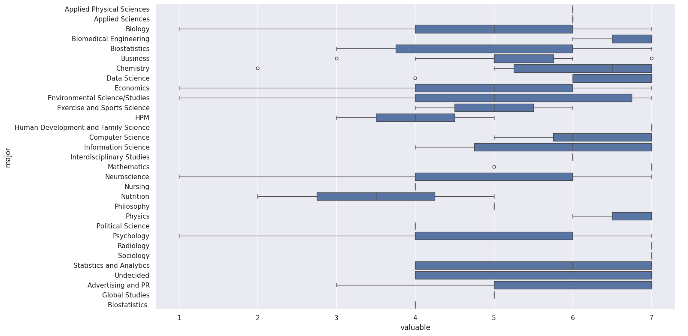

---
# Do not edit the text between these lines!
layout: default
---

# Analysis for Continuous Improvement

<!-- This is a comment. Below, you'll see code for inserting an image. To make this image appear, update <custom-path>. To add an image, save it inside the imgs folder of this repository. -->

*For this exercise, students were tasked with evaluated class survey data to evaluate how Comp 110 could be improved.*

## Proposed Improvement

I initially generated 5 potential methods that could add value to the course, including:

1. **The course should include exercises that analyze scientific data to demonstrate how computer science is applicable to the research field for students interested in graduate or medical school.**

2. The course should implement more challenge questions to help students practice a concept that will be applied in exercises.

3. The course should have review sessions for two nights before each quiz so students have ample time to review the material if they couldn not attend the session.

4. The course should include an online forum where students can ask simple concept questions remotely in lieu of attending office hours to lessen TA workload and free up office hour time for longer questions.

5. The course should begin by teaching the concept of unit tests so that students are more equipped to interpret the autograder before their first exercise. 

Ultimately, I selected proposal number 1 as I anticipated the survey data would provide the most relevant information to evaluate this claim.

## Comp 110 Student Majors

First, I aimed to identify the composition of different student majors in the class. I checked student responses asking them to indicate if they intend on pursuing a major in computer science and generated a bar graph of the results shown below. It clearly revealed that although Comp 110 is a necesary course for computer science majors, the majority of students in the class do not plan on majoring in this field.

Additionally, I wnated to determine which were the most popular majors outside of computer science. To do this, I analyzed student responses to the question asking for their major and found the total number of responses for each major. Then, I generated another bar graph depicting the amount of students for each major that had at least 10 responses. This revealed that a majority of the students in the class have majors in the field of life sciences, including **biology, neuroscience, and environmental sciences**.

## Relationship Between Value and Interest

Next, I wanted to explore how students' agreement to the claim "Student believes the skills they are learning in this course will be valuable to them in the future" impacted their interest in the course topics (Are they intellectually interesting?) as well as if they would recommend the course to other students. For each of these categories, the higher the number selected by the student, the more valuable and interesting they find the course, and the more likely they would recommend it. Shown below, we find that there is a consistent trend in which students who find the course more valuable to them in the future are also more confident they would recommend the course and agree that they find the topics intellectually interesting. This supports my proposed improvement to the course by suggesting that the value students find in the course is also reflected in their interest and enjoyment of it.

## Relationship between Value and Major

Lastly, I wanted to determine how students with majors outside of computer science, especially the most popular majors like biology and neuroscience, rated the value of Comp 110 for their future. If students with life science majors primarily ranked the value of the course to their future low, this would support my proposed improvement of including more science-based applications of computer science in the course. However, as shown below, the majority of majors generally found the course to be highly valuable. The lowest values were selected by Nutrition and HPM majors (median "valuable" score less than or equal to 4), while Biology and Neuroscience majors had a slightly higher score for the perception of the course value (median "valuable score around 5). Students with majors such as Computer Science, Biomedical Engineering, Data Science, Chemistry, Physics, and Statistics and Analytics tend to consider the course more valuable (median "valuable score around 6.) 

## Conclusion

Overall, my analysis of the data was slightly supports my idea. Including exercises that analyze scientific data to indicate the use of computer science in the life sciences fields is relevant considering the high number of students taking Comp 110 who are Biology, Neuroscience, and Earth Science majors. Additionally, there is a clear positive correlation between how valuable the student perceives the course and how likely they would be to recommend the course and how interesting they found it. Therefore, ensuring that students can directly see how computer science can be implemented for biomedical research may increase how valuable they find the course and their overall enjoyment of computer science, provided a more positive class experience. Finally, I also found that students with majors likely to involve computer science, like Data Science, Statstics, and Information Sciences,and those with majors in the field of physical science, like Physics and Chemistry- tended to value the course more than students with biological or environmental interests. However, students with Biolgy, Neuroscience, or Environmental Science majors still ranked the value of the course relatively high (greater than 4 on the scale of highly disagree (1) to highly agree (7)). Thus, while there may not be an immediate need to implement this strategy, it could potentially help the large portion of students in the biological fields become more invested in the course.

This idea could be refined by gathering data from current biomedical graduate or medical students at UNC to understand how they use computer science in their daily life to get a better sense of what skills would be most useful to teach students. Additionally, it might be worth collecting data from the Comp 110 students asking why they decided to take the course. If many of the Biology and Neuroscience majors who take the class do not intend to use computer science in the future, but need the course as a general education credit, it might not be worth altering the course significantly. However, if many students have an anticipated skill they want to learn from the course, that could be more reason to ensure students of these popular majors are finding value in Comp 110. Additionally, looking at survey results from other sections and past years could be helpful in identifying if the large proportion of non-Computer Science majors for this course is consistent or merely a fluke for this semester and section.

The stakeholders most likely to be negatively impacted by implementing my idea would be the professor and TAs. It would require additional work on their part to create a new exercise or task that exemplifies the use of computer science in other scientific fields. This may also be out of the realm of knowledge for many TAs who focus on studying Computer Science. Additionally, students with majors outside of the biological sciences may struggle to complete exercises involving biological scientific data if it requires extensive knowledge of how the data was collected or its purpose. Lastly, too much confusion might be added to the exercises when simplicity is best to expose students to the most basic computer science techniques. To compromise, rather than create new exercises focusing on using computer science techniques to analyze scientific data, the professor can just take more time during class to mention the relevant uses of given techniques in other fields or a final "exploratory" exercise could be designed where students select the type of data they analyze. 